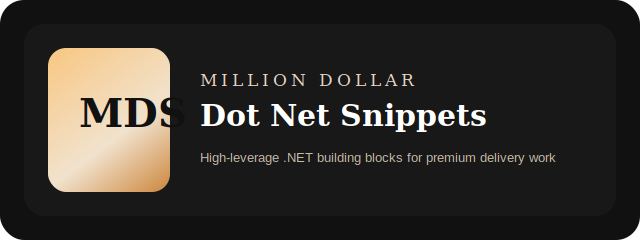
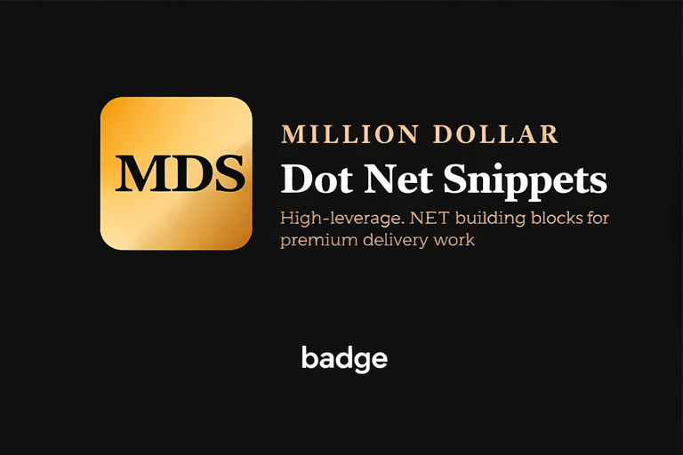
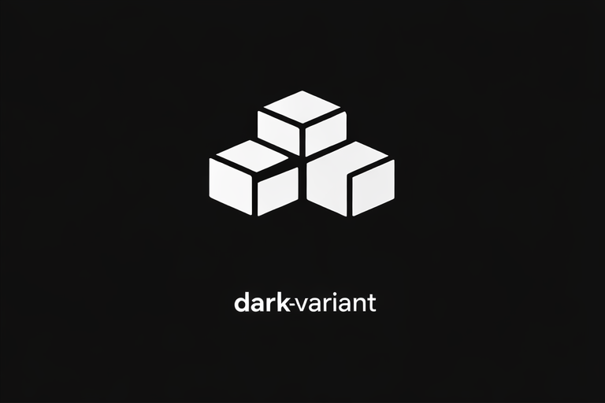

<p align="center">
  
</p>

<h1 align="center">Million Dollar Dot Net Snippets</h1>

<p align="center">
  High-leverage .NET building blocks for consultants and solution architects who get paid to make difficult business software move faster.
</p>

<p align="center">
  
</p>

<p align="center">
  <sub>Core system mark (packages, CLI, low-resolution contexts)</sub>
</p>

<p align="center">
  <a href="./docs/personas/high-roi-consultant.md">Highest-ROI Persona</a> ·
  <a href="./docs/GettingStarted.md">Getting Started</a> ·
  <a href="./docs/Architecture.md">Architecture</a> ·
  <a href="./docs/use-cases/highest-roi-use-cases.md">Use Cases</a> ·
  <a href="./docs/adoption-playbook.md">Adoption Playbook</a> ·
  <a href="./docs/README.md">Docs Index</a> ·
  <a href="./docs/accessibility.md">Accessibility</a> ·
  <a href="./docs/brand-system.md">Brand System</a> ·
  <a href="./docs/vision-brief.md">Vision Brief</a> ·
  <a href="./examples/ConsultantQuickstart">Quickstart</a>
</p>

---

<p align="center">
  
</p>

<p align="center">
  <sub>Presentation / marketing surface (README, landing, LinkedIn)</sub>
</p>

---

<p align="center">
  
</p>

<p align="center">
  <sub>Monochrome / low-light UI variant</sub>
</p>

## The Promise

This repo exists for a specific kind of .NET professional:

the consultant, architect, or lead engineer whose value comes from compressing delivery time on internal tools, APIs, automations, integrations, and operational software.

The repo promise is not “100 random snippets.”
It is this:

- turn repeated engineering moves into reusable leverage
- reduce time lost to scaffolding and utility sprawl
- make adoption obvious for the highest-ROI user
- present that utility with the confidence of a serious product
- evolve toward a consultant acceleration framework, not a code dump

## Who It Is For

This repo is built for people working in:

- internal tools
- ERP and CRM integrations
- CAD and manufacturing-adjacent automation
- admin backplanes and line-of-business APIs
- workflow orchestration and operations software

If you regularly move between messy systems, write glue code under deadline pressure, or need a reusable utility edge across client work, this repo is for you.

Read:

- [Highest-ROI Persona](/Users/cadguardianllc/Documents/GitHub/MillionDollarDotnetSnippets/docs/personas/high-roi-consultant.md)
- [Highest-ROI Use Cases](/Users/cadguardianllc/Documents/GitHub/MillionDollarDotnetSnippets/docs/use-cases/highest-roi-use-cases.md)
- [Adoption Playbook](/Users/cadguardianllc/Documents/GitHub/MillionDollarDotnetSnippets/docs/adoption-playbook.md)

## How You Use It

You do not need to “adopt the repo.”
You use it the same way high-performing consultants use any strong utility layer:

1. Find the repeated problem in the current engagement.
2. Take the smallest helper or pattern that removes the most drag.
3. Adapt it to the project in front of you.
4. Repeat until your delivery stack gets sharper and more reusable.

Typical wins:

- faster API scaffolding
- cleaner object mapping
- safer retries and logging
- easier parsing of ugly inbound data
- less one-off utility code per client project

## Start Here

If you want the shortest path from landing page to productive use:

1. Build the repo with `dotnet build MillionDollarDotnetSnippets.slnx`
2. Run the example in [examples/ConsultantQuickstart](/Users/cadguardianllc/Documents/GitHub/MillionDollarDotnetSnippets/examples/ConsultantQuickstart)
3. Read the [Getting Started guide](/Users/cadguardianllc/Documents/GitHub/MillionDollarDotnetSnippets/docs/GettingStarted.md)
4. Review the [Architecture guide](/Users/cadguardianllc/Documents/GitHub/MillionDollarDotnetSnippets/docs/Architecture.md)
5. Use the [Docs Index](/Users/cadguardianllc/Documents/GitHub/MillionDollarDotnetSnippets/docs/README.md) for everything else

## Product Surface

| Capability area | What it helps you do | Representative helpers |
|---|---|---|
| Build Faster | shape data, wire utilities, move faster in new projects | `CreateByName`, `MapProps`, `GroupByKey`, `RegisterAll` |
| Ship Safer | reduce runtime surprises and tighten delivery quality | `RetryAsync`, `TryWrap`, `LogJson`, `MustBePresent` |
| Automate More | package repeat work into tooling and dynamic helpers | `CreateGetter`, `GenerateCodeTemplate`, `ReadStreamAsync`, `WriteBlock` |
| Integrate Messy Systems | stabilize inputs, config, and system boundaries | `ParseCsvLine`, `CurrentEnv`, `LoadEnv`, `Memoize` |

Product capability map: [product-surface.md](/Users/cadguardianllc/Documents/GitHub/MillionDollarDotnetSnippets/docs/product-surface.md)  
Implementation map: [snippet_category_impact_mapping.md](/Users/cadguardianllc/Documents/GitHub/MillionDollarDotnetSnippets/snippet_category_impact_mapping.md)

## What Ships Today

- a root solution file at `MillionDollarDotnetSnippets.slnx`
- a modular solution spine for core, application, infrastructure, rules, and extensions
- a buildable `.NET 8` library at `src/MillionDollarDotnetSnippets`
- a runnable golden-path quickstart example at `examples/ConsultantQuickstart`
- archived legacy repo structure in `archive/legacy-flat-files`
- brand assets and identity in `assets/`
- indexed product, persona, and operating docs in `docs/`
- GitHub contribution and CI scaffolding in `.github/`

## Start in 60 Seconds

```bash
dotnet build MillionDollarDotnetSnippets.slnx
dotnet run --project examples/ConsultantQuickstart/ConsultantQuickstart.csproj
```

Basic usage:

```csharp
using MillionDollarDotnetSnippets;

var token = Phase3Snippets.SecureToken();
var environment = Phase4Snippets.CurrentEnv();
var grouped = Phase1Snippets.GroupByKey(new List<int> { 1, 2, 3, 4 }, x => x % 2);
```

The current source still uses `Phase*Snippets` modules internally.
That is an implementation detail, not the product story.

## Why This Repo Feels Different

This repo is being built like a technology-enabled product company artifact, not a casual snippet archive.

- one clear high-value persona
- stronger visual identity
- single solution entrypoint
- buildable source layout
- runnable example
- indexed docs instead of loose reference files
- explicit accessibility standards for docs and SVG assets
- explicit contributor and governance surface
- room for the team to fully revise vision and presentation from the title alone

## Accessibility and Premium Standard

Premium is a quality bar here, not permission to become harder to use.

- SVG assets include accessible labels and descriptions
- repo navigation is designed to be readable in linear and screen-reader flows
- brand assets are governed by a visual system instead of ad hoc decoration
- accessibility has named ownership and can block regressions

Supporting docs:

- [Accessibility Standards](/Users/cadguardianllc/Documents/GitHub/MillionDollarDotnetSnippets/docs/accessibility.md)
- [Brand System](/Users/cadguardianllc/Documents/GitHub/MillionDollarDotnetSnippets/docs/brand-system.md)
- [Premium Pass Checklist](/Users/cadguardianllc/Documents/GitHub/MillionDollarDotnetSnippets/docs/premium-pass-checklist.md)

## Team Authority

The team is explicitly allowed to completely revise the README, vision, packaging, and product expression as long as the result better delivers on the title:

**Million Dollar Dot Net Snippets**

Supporting docs:

- [Vision Brief](/Users/cadguardianllc/Documents/GitHub/MillionDollarDotnetSnippets/docs/vision-brief.md)
- [Operating Model](/Users/cadguardianllc/Documents/GitHub/MillionDollarDotnetSnippets/docs/operating-model.md)
- [Acceptance Gates](/Users/cadguardianllc/Documents/GitHub/MillionDollarDotnetSnippets/docs/acceptance-gates.md)
- [Accessibility Standards](/Users/cadguardianllc/Documents/GitHub/MillionDollarDotnetSnippets/docs/accessibility.md)
- [Brand System](/Users/cadguardianllc/Documents/GitHub/MillionDollarDotnetSnippets/docs/brand-system.md)
- [Premium Pass Checklist](/Users/cadguardianllc/Documents/GitHub/MillionDollarDotnetSnippets/docs/premium-pass-checklist.md)
- [Role Charters](/Users/cadguardianllc/Documents/GitHub/MillionDollarDotnetSnippets/docs/roles)

## Enterprise Team

This repo now assumes enterprise-level ownership across product, code, platform, design, accessibility, and adoption.

- Senior .NET Architect / Library Owner
- Technical Writer / Developer Experience Editor
- QA / Test Automation Engineer
- Product / Positioning Lead
- Developer Relations / Community Lead
- Growth Product Marketer / Content Lead
- Design / Brand Systems Lead
- Accessibility & UX Quality Lead
- Platform / Release Engineer

## Contributing and Trust

- [Contributing guide](/Users/cadguardianllc/Documents/GitHub/MillionDollarDotnetSnippets/CONTRIBUTING.md)
- [Code of conduct](/Users/cadguardianllc/Documents/GitHub/MillionDollarDotnetSnippets/CODE_OF_CONDUCT.md)
- [Security policy](/Users/cadguardianllc/Documents/GitHub/MillionDollarDotnetSnippets/SECURITY.md)
- [Support guide](/Users/cadguardianllc/Documents/GitHub/MillionDollarDotnetSnippets/SUPPORT.md)

## Licensing

This repo is not open source.
Commercial use, embedding, and licensing questions should go to `tsmithcad@gmail.com`.

See [LICENSE.txt](/Users/cadguardianllc/Documents/GitHub/MillionDollarDotnetSnippets/LICENSE.txt) for current terms.
